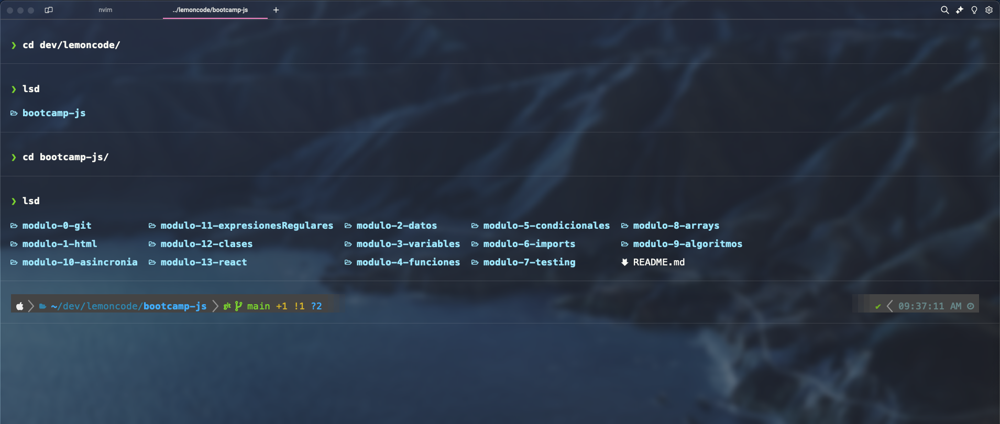
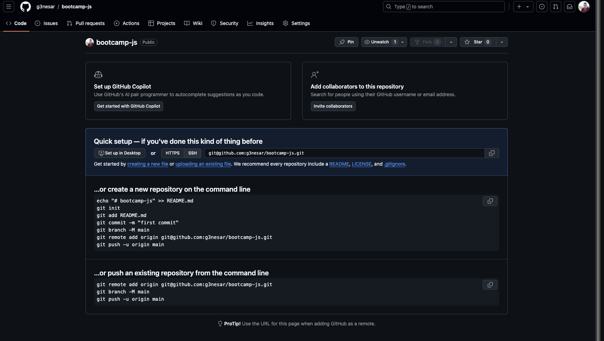

## Importante

El repositorio debe contener un archivo README.md con la descripcion de lo que se ha realizado en el
laboratorio, si quieres puedes anadir capturas de pantalla para explicar como has realizado el
laboratorio.

## Pasos para la realizacion de este laboratorio.

1. Se creo la estructura de carpetas para todo el bootcamp. La estructura consiste en tener una carpeta principal con el nombre de "Bootcamp-js" y dentro de ella las subcarpetas para cada laboratorio de todo el Bootcamp. ejemplo: "modulo-0-git, modulo-1-HTML, etc..."

2. Se inicializo el repositorio git en la carpeta principal del bootcamp para llevar un control global de todos los archivos de todos los laboratorios del bootcamp. Esto con la idea de crear un solo repositorio para todos los laboratorios y que sea mas facil de gestionar las entregas. Utilizando el comando "git init"

3. Se creo el repositorio en la cuenta de github donde se subira y se configuro el repositorio local con el repositorio de github utilizando SSH.

4. Se creo el archivo README.md dentro de la carpeta raiz para describir el objetivo del repositorio.

5. Se creo el archivo README.md dentro de la carpeta modulo-0-git (este archivo) donde se describira los pasos para realizar el laboratorio de git.

6. Se creo la rama development para realizar cambios en este archivo. se utilizaron los siguientes comandos: "git checkout -b development" para crear la rama y moverse a ella. Luego se realiza un "git add ." y un "git commit" para agregar los cambios. Luego se utiliza "git checkout main" para regresar a la rama principal y luego un "git merge development" para fusionar las dos ramas.

7. Por ultimo se hara un "git push origin main" para subir los cambios al respositorio de github.
